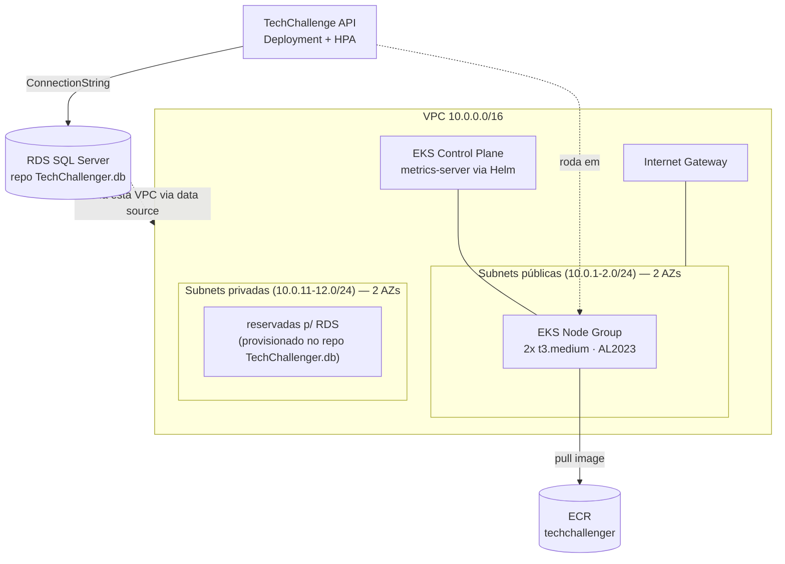

# TechChallenge.k8s

## Descrição
Infraestrutura como código (Terraform) da **rede e do cluster Kubernetes** do Tech Challenge: VPC, subnets, cluster EKS gerenciado com autoescala e registry de imagens. É a base sobre a qual rodam a [API principal](https://github.com/TechChallenge01/TechChallenge) (em Kubernetes), a [função serverless de autenticação](https://github.com/TechChallenge01/TechChallenger.auth) e o [banco de dados gerenciado](https://github.com/TechChallenge01/TechChallenger.db) — os outros dois repos descobrem a VPC/o cluster criados aqui via `data source` (por tag/nome), sem acoplamento de state.

Este repositório é um dos quatro que compõem o Tech Challenge:

| Repositório | Papel |
|---|---|
| [TechChallenge](https://github.com/TechChallenge01/TechChallenge) | Aplicação principal (API em Kubernetes) |
| [TechChallenger.auth](https://github.com/TechChallenge01/TechChallenger.auth) | API Gateway + Function Serverless de autenticação por CPF |
| [TechChallenger.db](https://github.com/TechChallenge01/TechChallenger.db) | Infraestrutura do banco de dados gerenciado (Terraform) |
| **TechChallenger.k8s** (este) | Infraestrutura do cluster Kubernetes e rede (Terraform) |

## Tecnologias utilizadas
- **Terraform** >= 1.5 — provider `hashicorp/aws` ~> 5.0, `hashicorp/kubernetes`, `hashicorp/helm`
- **AWS EKS** — cluster Kubernetes gerenciado + managed node group (Amazon Linux 2023)
- **AWS ECR** — registry das imagens Docker publicadas pelas esteiras de CD
- **Helm** — instala o `metrics-server` no cluster (necessário para o HPA da API principal funcionar)
- **AWS Academy Learner Lab** — usa a `LabRole` pronta (o lab bloqueia `iam:CreateRole`)

## Arquitetura



## O que é provisionado

| Recurso | Arquivo | Descrição |
|---|---|---|
| VPC, IGW, subnets públicas/privadas, route tables | `vpc.tf` | Rede — subnets públicas para os nós do EKS (sem NAT, para economizar); as privadas ficam reservadas para o RDS, provisionado pelo `TechChallenger.db` |
| Cluster EKS + managed node group + `metrics-server` (Helm) | `eks.tf` | Kubernetes gerenciado. `ami_type = "AL2023_x86_64_STANDARD"` (o AMI padrão AL2 não é mais publicado para versões recentes do EKS) |
| Repositório ECR | `ecr.tf` | Registry da imagem da API principal; lifecycle mantém as 10 imagens mais recentes |
| IAM (LabRole) | `iam.tf` | `data "aws_iam_role" "lab_role"` — role padrão do AWS Academy |
| Variáveis / outputs / providers | `variables.tf`, `outputs.tf`, `provider.tf` | Parametrização (região, CIDRs, tamanhos, versão do k8s) e valores expostos após o apply |

> O RDS **não** é provisionado aqui — ver [`TechChallenger.db`](https://github.com/TechChallenge01/TechChallenger.db). Esse repo acha a VPC e o security group do cluster criados aqui via `data source` (por tag `Name` / nome do cluster), então a ordem de apply é: **este repo primeiro**, depois o `TechChallenger.db`.

## Pré-requisitos

- **Terraform** >= 1.5 e **AWS CLI v2**
- Credenciais temporárias do **AWS Academy Learner Lab** em `~/.aws/credentials` (bloco `[default]` com `aws_access_key_id`, `aws_secret_access_key`, `aws_session_token`)
- Região `us-east-1` — `aws configure set region us-east-1` (grava em `~/.aws/config`)

## Como aplicar

```powershell
cd terraform
terraform init -backend-config="bucket=<BUCKET_DO_STATE>"
terraform plan -out tfplan
terraform apply "tfplan"       # ~12-15 min (o EKS domina o tempo)
terraform output
```

Se o `helm_release.metrics_server` falhar por timing do token do cluster (comum no 1º apply), rode `terraform apply -auto-approve` de novo — ele retoma.

Outputs relevantes: `cluster_name`, `cluster_endpoint`, `ecr_repository_url`. Esses valores alimentam o `terraform.tfvars`/secrets do `TechChallenger.db`, do `TechChallenge` e do `TechChallenger.auth`.

### Conectar o kubectl

```powershell
aws eks update-kubeconfig --name techchallenge --region us-east-1
kubectl get nodes
```

## Como destruir

Ordem **inversa** à de aplicação — quem depende sai primeiro:

```powershell
# 1) TechChallenger.auth (usa a VPC/EKS/RDS via data source + anexa no ASG do EKS)
# 2) TechChallenger.db   (usa a VPC/EKS via data source)
# 3) este repo (TechChallenger.k8s) por último:
cd terraform
terraform init -backend-config="bucket=<BUCKET_DO_STATE>"
terraform destroy
```

## Estado do Terraform

Backend **S3** (bucket compartilhado com os demais repos do Tech Challenge, key `techchallenge-k8s/terraform.tfstate`, versionamento ligado). O bucket é passado em tempo de `init` (`-backend-config="bucket=..."`), nunca fixo no código — nem local nem na esteira.

## CI/CD

- **`ci.yml`** — em todo PR para `main`: `terraform fmt` (advisório) + `terraform validate` (`-backend=false`, não precisa de credenciais AWS).
- **`cd.yml`** — em todo push na `main` (só entra via PR, branch protegida) ou disparo manual: autentica com as credenciais temporárias do Learner Lab e roda `terraform apply`. Único ambiente — o orçamento do AWS Academy não comporta um segundo cluster/VPC só para homologação (mesmo racional documentado no `cd.yml` do `TechChallenge`).

Secrets necessários no repositório (Settings → Secrets and variables → Actions): `AWS_ACCESS_KEY_ID`, `AWS_SECRET_ACCESS_KEY`, `AWS_SESSION_TOKEN` (temporários do Learner Lab, renovar a cada sessão) e `TF_STATE_BUCKET` (nome do bucket S3 do state).

## Notas

- Repositório de infraestrutura: não expõe API, portanto sem Swagger/Postman. Ver os READMEs de [`TechChallenge`](https://github.com/TechChallenge01/TechChallenge) e [`TechChallenger.auth`](https://github.com/TechChallenge01/TechChallenger.auth).
